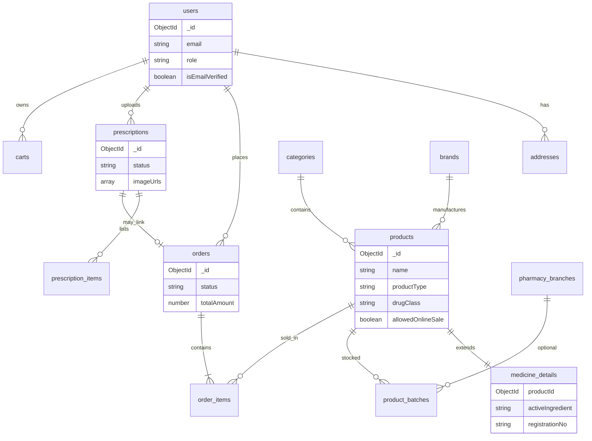

# Tổng quan Database — MedCare (MongoDB)

## 1. Sơ đồ quan hệ (MVP + mở rộng)



---

## 2. Danh sách collection

### Phase 0 — Đang có (giữ, chỉnh field)

| Collection | Ghi chú |
|------------|---------|
| `users` | Thêm `dateOfBirth`, `gender` (optional cho tư vấn) |
| `otps` | Giữ nguyên (auth) |
| `categories` | Thêm `parentId`, `categoryKind`, `icon` |
| `products` | Mở rộng field dược **hoặc** tách `medicine_details` |

### Phase 1 — MVP MedCare (nên làm sớm)

| Collection | Mục đích |
|------------|----------|
| `brands` | Hãng / công ty dược (DHG, Sanofi, …) |
| `medicine_details` | 1-1 với product: hoạt chất, SDK, cách dùng (nếu không embed) |
| `product_batches` | Lô, HSD, số lượng tồn theo lô |
| `addresses` | Sổ địa chỉ giao hàng |

### Phase 2 — Thương mại

| Collection | Mục đích |
|------------|----------|
| `carts` / `cart_items` | Giỏ hàng |
| `orders` | Đơn hàng |
| `order_items` | Chi tiết đơn |
| `prescriptions` | Đơn thuốc upload |
| `prescription_items` | Dòng thuốc trên đơn (sau khi dược sĩ nhập) |

### Phase 3 — Mở rộng

| Collection | Mục đích |
|------------|----------|
| `pharmacy_branches` | Chi nhánh |
| `medicine_reminders` | Nhắc uống thuốc |
| `health_profiles` | Dị ứng, bệnh nền (nhạy cảm — cần bảo mật) |
| `promotions` | Khuyến mãi |

---

## 3. Map migration từ schema hiện tại

### `categories` (cũ → mới)

```
Campus Shop seed          →  MedCare seed (ví dụ)
─────────────────────────────────────────────────
giay-sneaker              →  (xóa / không dùng)
thoi-trang                →  da-toc-mong | personal_care
phu-kien                  →  medical_device
lifestyle                 →  vitamin-khoang-chat | functional_food
```

Thêm field:

```js
parentId: ObjectId | null      // cây danh mục
categoryKind: enum             // medicine | supplement | device | cosmetic
sortOrder: Number
icon: String                   // URL hoặc tên icon
```

### `products` (cũ → mới)

**Giữ:** `name`, `slug`, `description`, `price`, `salePrice`, `images`, `stock`, `sold`, `category`, `isActive`, `isNew`, `isBestSeller`, `isSale`, `timestamps`

**Thêm (MVP):**

```js
productType: enum              // medicine_otc | medicine_rx | functional_food | ...
drugClass: enum                 // otc | rx | not_applicable
allowedOnlineSale: Boolean     // false nếu Rx chỉ cửa hàng
sku: String
barcode: String
brandId: ObjectId → brands
unitLabel: String               // "Hộp", "Chai"
packagingDescription: String   // "3 vỉ x 10 viên"
requiresPharmacistAdvice: Boolean
shortDescription: String        // 1-2 dòng cho card
```

**Tách bảng `medicine_details` (khuyến nghị):** tránh document `products` quá nặng.

---

## 4. Index đề xuất (hiệu năng)

| Collection | Index |
|------------|-------|
| `products` | `{ slug: 1 }` unique, `{ category: 1, isActive: 1 }`, `{ productType: 1 }`, `{ "name": "text", "sku": "text" }` |
| `products` | `{ drugClass: 1, allowedOnlineSale: 1 }` |
| `medicine_details` | `{ productId: 1 }` unique, `{ activeIngredient: 1 }` |
| `product_batches` | `{ productId: 1, expiryDate: 1 }` |
| `orders` | `{ userId: 1, createdAt: -1 }`, `{ status: 1 }` |
| `prescriptions` | `{ userId: 1, status: 1 }` |

---

## 5. Chiến lược đổi tên collection

| Phương án | Ưu | Nhược |
|-----------|-----|-------|
| **A. Giữ `products`** | Ít sửa API/React | Tên không “chuẩn dược” |
| **B. Đổi `products` → `medicines`** | Rõ nghĩa | Refactor toàn API, seed, admin |
| **C. View alias** | Không | Mongo không có view đơn giản như SQL |

**Đề xuất đồ án:** **Phương án A** + collection `medicine_details`; sau này đổi tên API `/medicines` nếu cần.

---

## 6. Seed MedCare (gợi ý số lượng)

| Loại | Số lượng demo |
|------|----------------|
| Categories (nhóm bệnh + TPCN) | 15–20 |
| Brands | 10 |
| Products OTC + TPCN + device | 30–50 |
| Product batches | 1–2 lô / sản phẩm |
| Users | Admin 1, Pharmacist 1 (phase 2), User vài account |

---

## 7. Công việc implement (checklist)

- [ ] Chốt phase 1 vs 2 với giảng viên / nhóm  
- [ ] Cập nhật Mongoose models + migration script xóa seed cũ  
- [ ] Seed MedCare (`productService` seed data)  
- [ ] API: filter theo `productType`, `drugClass`  
- [ ] FE: đổi brand MedCare, hiển thị hoạt chất / cảnh báo trên PDP  
- [ ] Chặn mua online nếu `allowedOnlineSale === false`  

Chi tiết field: xem [03-chi-tiet-collections.md](./03-chi-tiet-collections.md).
