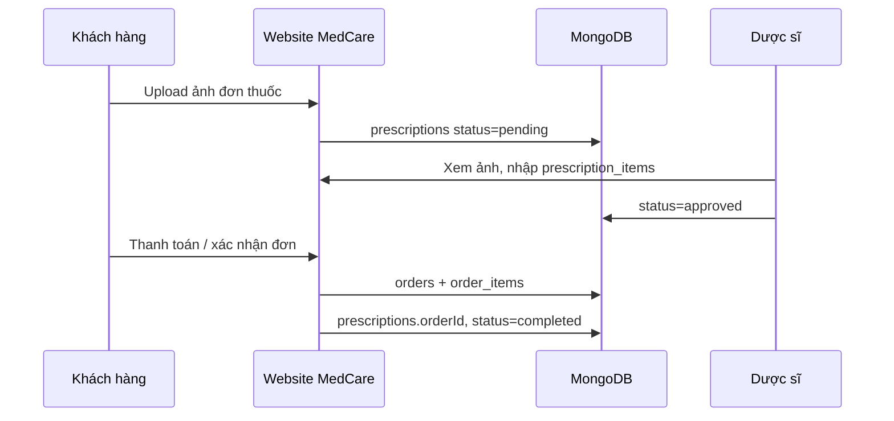

# Quy tắc nghiệp vụ — MedCare Database & API

Tài liệu này mô tả **logic hệ thống** cần enforce khi implement, bám quy định VN và thực tế Pharmacity / Long Châu.

---

## 1. Phân loại thuốc & kênh bán

### 1.1 Thuốc không kê đơn (OTC)

- `drugClass = otc`
- `allowedOnlineSale = true` (mặc định)
- Cho phép: thêm giỏ, đặt hàng, thanh toán online
- **Bắt buộc hiển thị** trên PDP: hoạt chất, cách dùng, cảnh báo
- Gợi ý copy UI: “Đọc kỹ hướng dẫn trước khi dùng”

### 1.2 Thuốc kê đơn (Rx)

- `drugClass = rx`
- `allowedOnlineSale = false` (MVP — bán tại quầy / sau duyệt đơn)
- Trên web:
  - Hiển thị thông tin **tra cứu**
  - Nút: **“Mua tại nhà thuốc”** hoặc **“Gửi đơn thuốc”** (P2)
- **Không** cho `POST /cart` với sản phẩm Rx nếu chưa có `prescription` approved

*Tham chiếu thực tế:* Pharmacity — thuốc kê đơn chủ yếu tại cửa hàng khi có đơn hợp lệ.

### 1.3 TPCN / thiết bị / mỹ phẩm

- `drugClass = not_applicable`
- `allowedOnlineSale = true`
- Footer PDP: “Sản phẩm này không phải là thuốc, không có tác dụng thay thế thuốc chữa bệnh” (TPCN)

---

## 2. Luồng đơn thuốc (Phase 2)



**Trạng thái `prescriptions.status`:**

| Status | Ý nghĩa |
|--------|---------|
| `pending` | Khách vừa gửi |
| `reviewing` | Dược sĩ đang xử lý |
| `approved` | Được phép tạo đơn hàng |
| `rejected` | Từ chối (sai ảnh, không đủ thông tin…) |
| `completed` | Đã gắn order |

---

## 3. Tồn kho & hạn dùng

### 3.1 MVP đơn giản

- Chỉ dùng `products.stock` (một số)
- Admin nhập tay HSD trong mô tả (text)

### 3.2 Chuẩn nhà thuốc (có `product_batches`)

- Mỗi lần nhập hàng → tạo batch mới
- `products.stock` = Σ `batches.quantity` (active, chưa hết hạn)
- Khi tạo `order_items` → trừ từ batch **expiryDate sớm nhất** (FEFO)
- **Không bán** batch đã hết hạn: `expiryDate < today`

```js
// Pseudo
async function allocateStock(productId, qty) {
  const batches = await Batch.find({
    productId,
    isActive: true,
    expiryDate: { $gte: new Date() },
    quantity: { $gt: 0 }
  }).sort({ expiryDate: 1 });

  // allocate from batches until qty satisfied
}
```

---

## 4. Giá & khuyến mãi

- `salePrice` phải `<= price`
- Thuốc Rx sau khi duyệt đơn có thể **giá snapshot** trong `order_items.unitPrice` (không đổi sau khi đặt)
- `isSale = true` chỉ khi có `salePrice` hợp lệ

---

## 5. Tìm kiếm & lọc (catalog)

**Filter API đề xuất:**

| Query | Mô tả |
|-------|--------|
| `keyword` | Tên, hoạt chất, SKU |
| `category` | slug hoặc id |
| `productType` | medicine_otc, functional_food, … |
| `drugClass` | otc, rx |
| `brand` | brand slug |
| `allowedOnlineSale` | true (trang mua hàng) |
| `inStock` | stock > 0 |
| `sort` | newest, best-selling, price-asc |

**Full-text:** index `name` + `medicine_details.activeIngredient`

---

## 6. Vai trò & quyền

| Role | Quyền DB/API |
|------|----------------|
| `User` | Đọc catalog; CRUD cart/order của mình; upload prescription |
| `Admin` | CRUD toàn bộ catalog, batches, duyệt đơn (nếu chưa tách Pharmacist) |
| `Pharmacist` (P2) | Đọc/sửa `prescriptions`, duyệt Rx, không xóa user |

---

## 7. Dữ liệu cũ Campus Shop

**Khi migrate:**

1. Backup MongoDB  
2. Xóa / deactivate products & categories seed cũ (`isActive: false`)  
3. Import seed MedCare mới  
4. Users cũ: giữ nguyên (auth không đổi)

**Script gợi ý (sau khi chốt):**

```js
await Category.updateMany({}, { $set: { isActive: false } });
await Product.updateMany({}, { $set: { isActive: false } });
// insert MedCare categories + products
```

---

## 8. Disclaimer trên UI (không lưu DB)

MedCare nên hiển thị cố định:

- Thông tin trên web chỉ mang tính **tham khảo**, không thay tư vấn bác sĩ/dược sĩ trực tiếp  
- Khẩn cấp y tế → gọi 115 / đến cơ sở y tế  
- Thuốc kê đơn tuân thủ đơn và hướng dẫn chuyên môn  

---

## 9. Checklist tuân thủ (đồ án / demo)

- [ ] OTC có đủ field hoạt chất + hướng dẫn  
- [ ] Rx không add-to-cart trực tiếp online (MVP)  
- [ ] Log không lưu mật khẩu / OTP plaintext  
- [ ] `health_profiles` (nếu có) phân quyền chặt  
- [ ] Seed không dùng tên thuốc giả mạo nhãn hiệu thật nếu không có license (đồ án: dùng tên generic “Paracetamol 500mg” OK)

---

## 10. Liên kết tài liệu

- [README](./README.md) — mục lục  
- [02-tong-quan-database.md](./02-tong-quan-database.md) — ER & phase  
- [03-chi-tiet-collections.md](./03-chi-tiet-collections.md) — bảng field  
